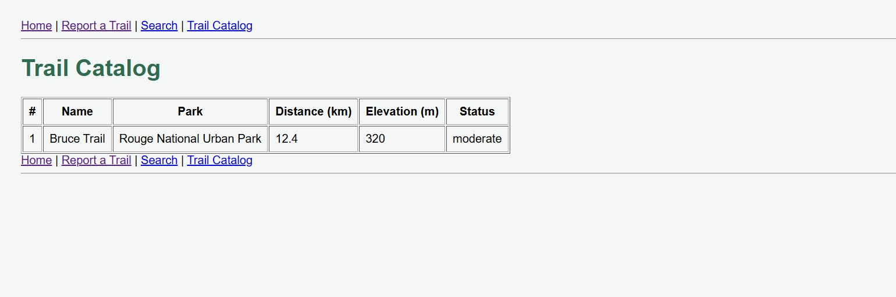
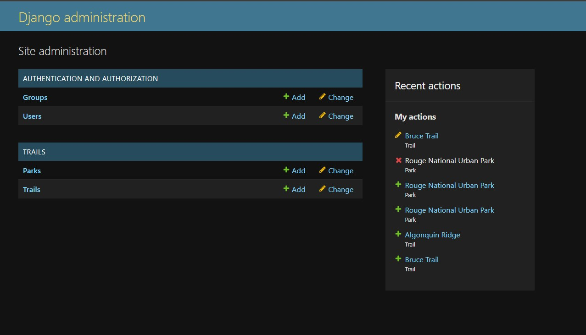

# Waypoint

Waypoint is a Django-based trail finder and trip-planning application developed for the Application Programming course.

The project was developed individually across Weeks 7–14. It started as a Python object-oriented domain model and was later expanded into a Django web application using templates, forms, ORM models, admin management, and database relationships.

## Features

- Trail catalog
- Open-trail filtering
- Trail distance and elevation information
- Trail difficulty information
- Park and Trail relationship using ForeignKey
- Filter trails by park
- Trail detail page
- Trail report form with CSRF protection
- Search page
- Django Admin for managing trails and parks
- Reusable Django templates with navbar and footer
- Django ORM and migrations
- Automated tests

## Technologies

- Python 3.12
- Django 4.2
- HTML
- CSS
- SQLite
- Git
- GitHub

## Setup

### 1. Clone the repository

```powershell
git clone https://github.com/mahbub-alahi/Waypoint.git
cd Waypoint
```

### 2. Create a virtual environment

```powershell
py -3.12 -m venv env
```

### 3. Activate the virtual environment

Windows PowerShell:

```powershell
.\env\Scripts\Activate.ps1
```

### 4. Install dependencies

```powershell
pip install -r requirements.txt
```

### 5. Apply database migrations

```powershell
py manage.py migrate
```

### 6. Run the development server

```powershell
py manage.py runserver
```

Open the application at:

```text
http://127.0.0.1:8000/
```

Trail catalog:

```text
http://127.0.0.1:8000/trails/
```

Django Admin:

```text
http://127.0.0.1:8000/admin/
```

## Testing

Run all automated tests with:

```powershell
py manage.py test
```

The Week 14 test suite covers:

- Public catalog showing open trails and excluding closed trails
- Missing trail detail returning HTTP 404
- Domain validation rejecting a negative distance

## Project Structure

```text
Waypoint/
├── trails/
│   ├── migrations/
│   ├── admin.py
│   ├── models.py
│   ├── tests.py
│   ├── urls.py
│   └── views.py
├── waypoint/
├── waypoint_core/
├── templates/
├── static/
├── manage.py
├── requirements.txt
└── README.md
```

## Database Relationships

Waypoint contains two main Django models:

- `Park`
- `Trail`

Each Trail can belong to a Park through a Django `ForeignKey`.

`on_delete=models.PROTECT` is used to prevent a Park from being deleted while Trail records still reference it.

## Screenshots

### Trail Catalog

!

### Django Admin



## Development History

The project was developed incrementally across Weeks 7–14 using separate Git feature branches, pull requests, reviews, and release tags.

- Week 7 — Domain model
- Week 8 — Inheritance, polymorphism and operators
- Week 9 — Django setup
- Week 10 — Views, URLs and forms
- Week 11 — Templates and trail catalog
- Week 12 — ORM, models and admin
- Week 13 — ForeignKey relationships
- Week 14 — Testing, hardening and final handoff